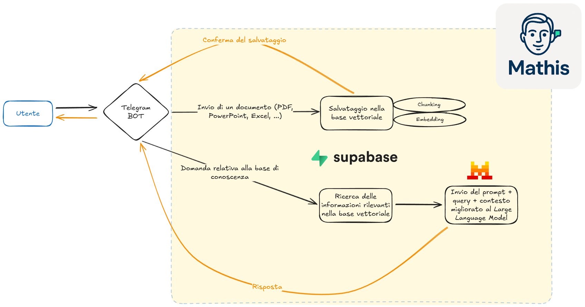

# Mathis - Un agente AI per il knowledge management personale, conversazionale e open source


## Descrizione
Mathis è un progetto open source scritto in Java che implementa un agente AI conversazionale tramite Telegram, dotato di funzionalità RAG (Retrieval-Augmented Generation). 
Il codice si basa sulle seguenti librerie e tecnologie :
- [Spring Boot](https://spring.io/projects/spring-boot)
- [Telegram Bot API](https://core.telegram.org/bots/api)
- [Apache Tika](https://tika.apache.org/)
- [Supabase](https://supabase.com/)
- [MistralAI](https://mistral.ai/) 

Lo scopo è quello di permettere agli utenti di costruire, espandere e interrogare una base di conoscenza attraverso uno scambio di messaggi in linguaggio naturale con il bot.

## Tecnologie e librerie utilizzate

Mathis è costruito con **Java 17** e si basa su [Spring Boot](https://spring.io/projects/spring-boot). 
L'integrazione con **Telegram** viene realizzata tramite le librerie [`telegrambots-springboot-longpolling-starter`](https://github.com/rubenlagus/TelegramBots) e `telegrambots-client`, che permettono la comunicazione con gli utenti tramite bot.

Per la componente AI e RAG (Retrieval-Augmented Generation), Mathis utilizza [Spring AI](https://spring.io/projects/spring-ai) con il modulo `spring-ai-starter-model-mistral-ai` per accedere ai modelli di MistralAI. 
L'archiviazione e la gestione vettoriale dei documenti è affidata a **PgVector** tramite `spring-ai-starter-vector-store-pgvector` e `spring-ai-advisors-vector-store`, che facilitano la ricerca semantica dei contenuti. 
L'estrazione automatica del testo dai documenti caricati è gestita da **Apache Tika** tramite la libreria `spring-ai-tika-document-reader`.

La persistenza e la sincronizzazione della knowledge base con **Supabase** vengono gestite attraverso l'integrazione con Postgres e PgVector. 

La scelta di queste tecnologie è fatta per rendere il più possibile il progetto Mathis una soluzione robusta, scalabile e facilmente estendibile per la gestione intelligente dei documenti e delle interazioni AI.

## Funzionalità

- **Conversazione naturale**: Interazione tramite chat Telegram con l'agente AI Mathis.
- **Caricamento documenti**: Invia documenti al bot, che li analizza tramite Tika ed estrae il testo rilevante.
- **Indicizzazione e storage**: I contenuti estratti vengono archiviati e indicizzati su Supabase.
- **RAG (Retrieval-Augmented Generation)**: Quando si pongono domande al bot, Mathis recupera i documenti rilevanti dalla base di conoscenza e genera risposte contestualizzate usando MistralAI.
- **Open Source**: Il progetto è completamente open, facilmente estendibile e personalizzabile.

## Architettura



## Come funziona

1. **Avvia Mathis**: Lancia il bot Mathis su un server con Java 17+.
2. **Invia documenti**: Manda file (PDF, DOCX, ecc.) al bot su Telegram. Mathis usa Tika per estrarre il testo e salva tutto su Supabase.
3. **Fai domande**: Poni domande in chat riferite ai contenuti caricati. Mathis cerca nella knowledge base e risponde usando MistralAI, arricchendo la risposta con i contenuti trovati.

## Requisiti

- Java 17+
- Un account Telegram e token BotFather
- Un'istanza Supabase configurata
- API key MistralAI

## Installazione

1. **Clona il repository**
   ```bash
   git clone https://github.com/tuo-username/Mathis.git
   cd Mathis
   ```

2. **Configura le variabili ambiente e riscrivi il tuo file di properties YML**
   - `TELEGRAM_BOT_TOKEN`
   - `SUPABASE_URL` e `SUPABASE_KEY`
   - `MISTRAL_API_KEY`

3. **Costruisci ed esegui**
   ```bash
   ./mvnw spring-boot:run
   ```

## Utilizzo

- **/start**: (opzionale) Avvia la conversazione con Mathis ottenendo una presentazione dell'agente nella lingua dell'account Telegram.
- **Invia un documento**: Carica un file direttamente nella finestra di chat di Telegram per aggiungerlo alla base di conoscenza.
- **Fai una domanda**: Scrivi una domanda basata sui documenti caricati.

## Contribuire

Contribuzioni, segnalazioni di bug e nuove funzionalità sono benvenute! Apri una issue o un pull request.

## Licenza

Questo progetto è distribuito sotto licenza GNU GENERAL PUBLIC LICENSE Version 3, 29 June 2007 (GPLv3).